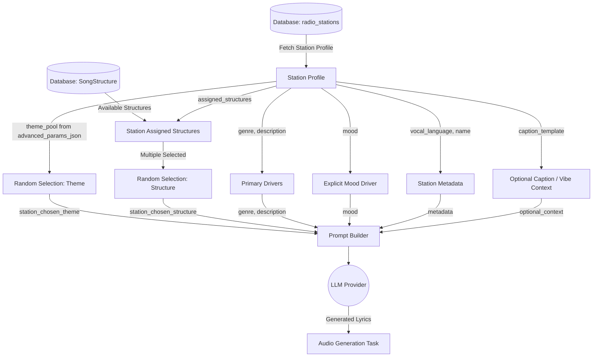

# Radio Lyrics Generation Upgrade Strategy

This document outlines the architectural blueprint and technical strategy for upgrading the AI-driven radio lyrics generation in `tadpole-studio`.

## 1. Objectives and Requirements

Based on user feedback and previous discussions, the lyrics generation logic for the radio feature needs to be more context-aware and configurable. The key requirements are:

1. **Song Structures Repository:** Introduce a global database repository (`SongStructure` table) that holds various song structures (e.g., Pop AABA, Metal Core, Standard Verse-Chorus).
2. **Station Structure Assignment:** Stations can select *one or many* structures from this repository. When generating a song, one of these selected structures is chosen at random to provide structural variety.
3. **Explicit Mood Usage:** Leverage the existing `mood` field on the station to act as a primary emotional driver in the prompt, taking strict precedence over generic or randomly injected moods.
4. **Primary Drivers over Captions:** The core drivers for lyric generation must be the existing `genre` and `description` fields. The dynamic `caption` (the vibe/texture) will only be supplied as optional background *context* at the end of the prompt, not as the primary driver.
5. **Configurable Theme Pool:** Allow users to define a custom pool of themes per station to ensure thematic variety while preserving narrative focus. (This will be stored in the existing `advanced_params_json` field to avoid unnecessary schema migrations).

## 2. Architecture & Data Flow

### Data Flow Diagram

The following Mermaid flowchart illustrates how data moves from the database, through random selections, and into the final LLM prompt.



## 3. Data Inputs and Sources

The table below breaks down the variables injected into the final LLM lyrics prompt, explaining their origin and how they are computed.

| Input Variable | Description | Source / Origin |
| :--- | :--- | :--- |
| **Genre & Description** | *[PRIMARY DRIVERS]* The defining musical style and overall concept of the station. This replaces the caption as the main driver for lyrics. | DB: Existing `radio_stations.genre` and `radio_stations.description` fields. |
| **Mood** | The core emotional tone of the track. Explicitly overrides any generic or randomized mood. | DB: Existing `radio_stations.mood` field. |
| **Song Structure** | *[NEW]* The structural layout of the song (e.g., Verse, Chorus, Verse, Bridge, Chorus). | Randomly chosen from the Station's assigned `SongStructure` repository links. |
| **Chosen Theme** | A specific narrative theme used to ensure each track is distinct. | DB: Stored inside existing `radio_stations.advanced_params_json['theme_pool']`. |
| **Station Name** | The name of the station, used for stylistic context. | DB: Existing `radio_stations.name` field. |
| **Vocal Language** | Language instruction for the lyrics. | DB: Existing `radio_stations.vocal_language` field. |
| **Vibe / Caption Context** | Optional background texture/atmosphere data. Pushed to the end of the prompt to avoid overwhelming the primary drivers. | Generated by `_generate_caption_with_llm` OR DB: Existing `radio_stations.caption_template` field. |

*Note on `prompt_addon`, `lyrics_style_addons`, and `intensity`: Rather than adding new schema columns, any additional prompt instructions can be managed via the existing `description`, `mood`, or `caption_template` fields. If specialized internal prompt logic is needed, these can be stored dynamically in the `advanced_params_json` dictionary.*

## 4. Implementation Steps

### Step 1: Database Schema Update
1. Create a `SongStructure` table in the database to act as the global repository of structures (e.g., id, name, format_description).
2. Create a many-to-many junction table linking `radio_stations` to `SongStructure`.
3. *No schema changes required for `radio_stations` itself:* We will rely on the existing `genre`, `description`, `mood`, and `advanced_params_json` fields.

### Step 2: Service Logic Update
1. Modify the prompt builder to pull `genre`, `description`, and `mood` as the central focus of the `system` and `user` messages.
2. Load the station's assigned structures. If multiple exist, randomly select one for the current generation. Inject this structure format into the prompt.
3. Load the `theme_pool` from `advanced_params_json`, randomly select one, and inject it as the lyrical narrative guide.
4. Move the `caption` data to an "Optional Background Context" section at the end of the prompt.

### Step 3: Frontend UI Update
1. Add a UI for managing the global `SongStructure` repository.
2. Update station creation/edit dialogs to allow selecting one or multiple song structures from the repository.
3. Ensure `genre`, `description`, and `mood` inputs are prominent, and demote any visual emphasis on caption generation. Add support for managing the `theme_pool` within the advanced settings.

## 5. Backend Implementation Example

```python
        # Extract dynamic values from advanced_params_json (defaulting gracefully)
        theme_pool = station.advanced_params_json.get("theme_pool", [])
        station_chosen_theme = random.choice(theme_pool) if theme_pool else station.description
        lyrics_style_addons = station.advanced_params_json.get("lyrics_style_addons", "Standard style")
        intensity = station.advanced_params_json.get("intensity", "Moderate")

        prompt = (
            f"Write a {station.genre} song in {station.vocal_language} about '{station_chosen_theme}' using this exact structure:\n"
            f"{station_chosen_structure}\n\n"
            "STRICT REQUIREMENTS:\n"
            "1. Write ONLY the song lyrics - no translations, no explanations, no notes\n"
            f"2. Use ONLY the specified language: {station.vocal_language}\n"
            "3. Follow the structure EXACTLY as shown\n"
            "4. Format each section header exactly as shown (e.g. [Verse 1])\n"
            "5. Never include any text outside the lyrics structure\n"
            f"6. Target Duration: {station_duration}s\n"
            f"7. Musical Key: {station_keyscale}\n\n"
            "STYLE GUIDELINES:\n"
            f"- {lyrics_style_addons}\n"
            f"- {intensity} feel\n"
            f"- {station.mood} mood\n"
            f"- Concept/Description: {station.description}\n"
            "- Use vivid imagery and emotional resonance\n"
            f"- Match the rhythm and phrasing to {station.genre} conventions\n\n"
            "BACKGROUND VIBE/CAPTION (For Optional Context):\n"
            f"{station_caption}\n\n"
        )